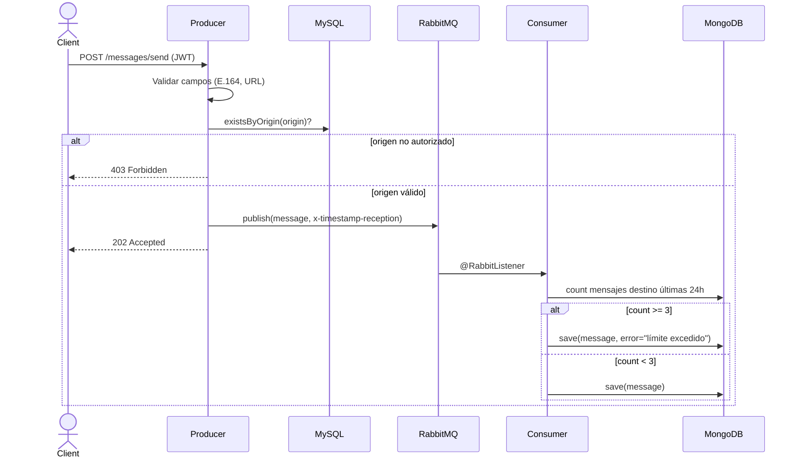
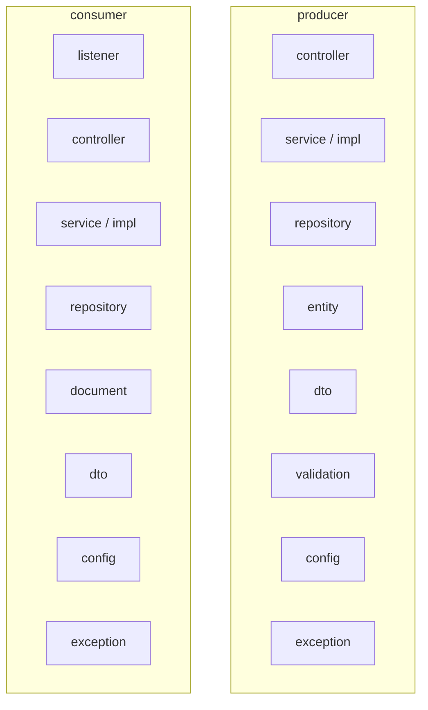
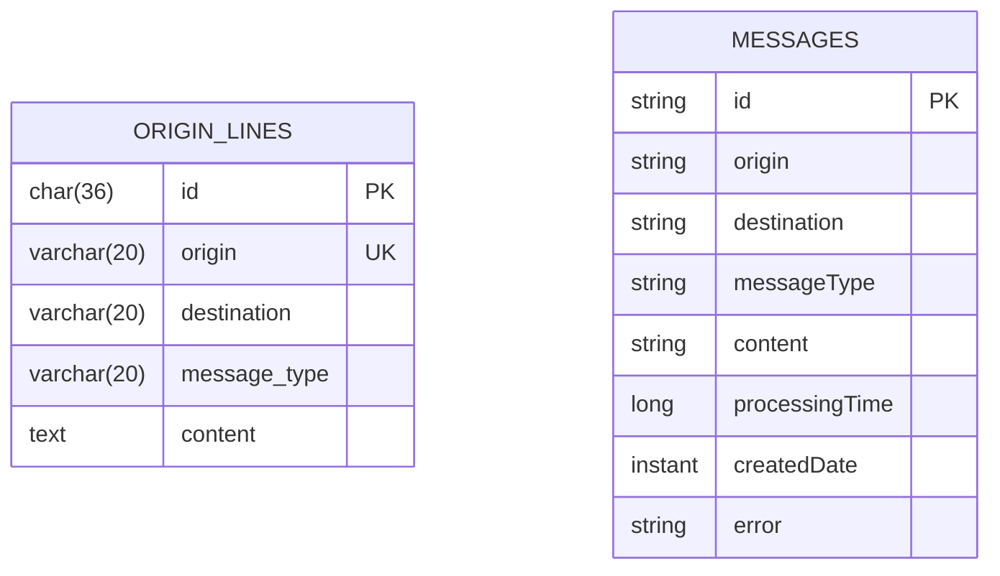

# Diseño del Sistema

## Arquitectura general

```mermaid
graph LR
    Client(["Cliente HTTP"])

    subgraph Producer [:8080]
        PC[MessageController]
        PS[MessageService]
        PA[AuthController]
        PDB[(MySQL)]
    end

    subgraph Broker
        RMQ[[RabbitMQ\nproducer.queue]]
    end

    subgraph Consumer [:8081]
        CL[MessageListener]
        CS[MessageService]
        CC[MessageController]
        CDB[(MongoDB)]
    end

    Client -->|POST /auth/login| PA
    Client -->|POST /messages/send + JWT| PC
    PC --> PS
    PS -->|existsByOrigin| PDB
    PS -->|publish + x-timestamp-reception| RMQ
    RMQ -->|@RabbitListener| CL
    CL --> CS
    CS -->|countByDestination 24h| CDB
    CS -->|save MessageDocument| CDB
    Client -->|GET /messages?destination=| CC
    CC --> CS
```

---

## Flujo de un mensaje



---

## Estructura de paquetes



---

## Modelo de datos


